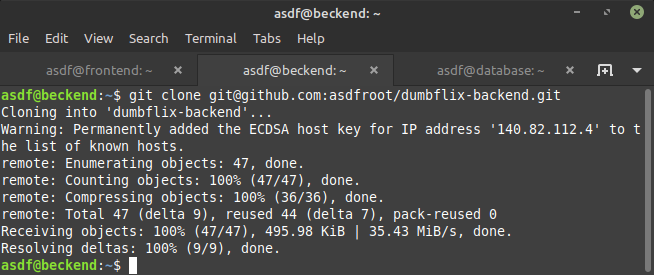
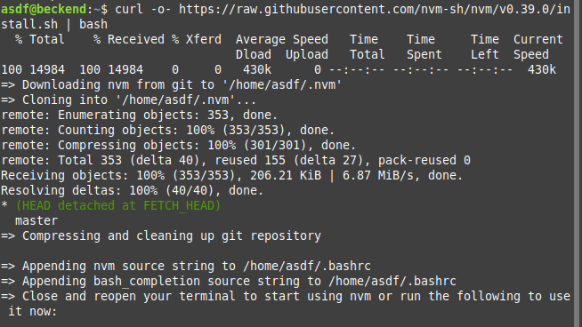
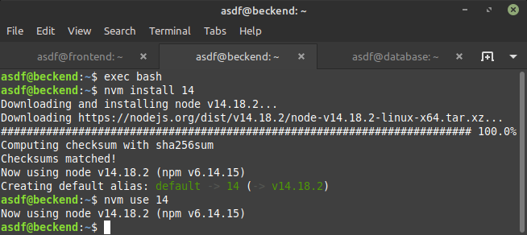
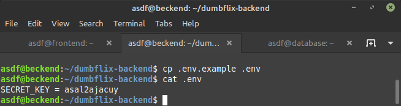
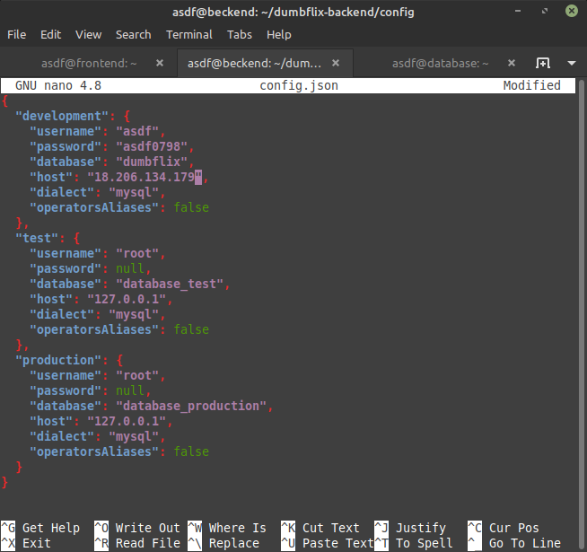
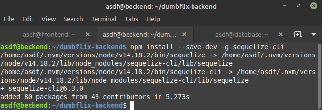
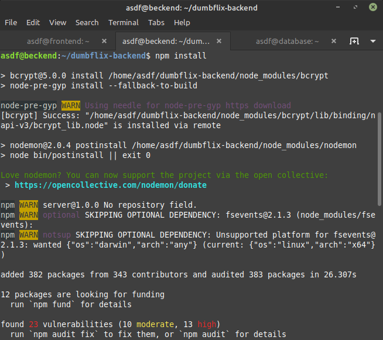
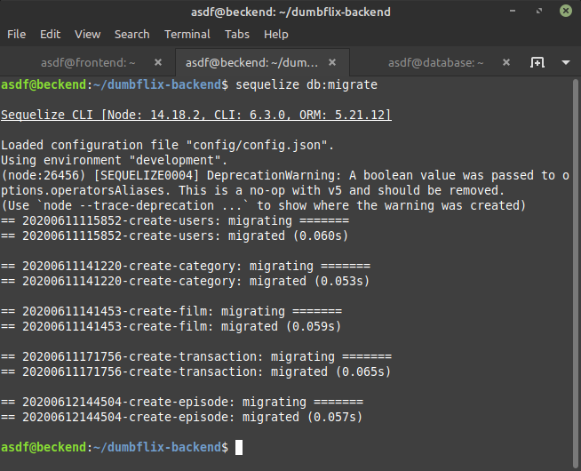
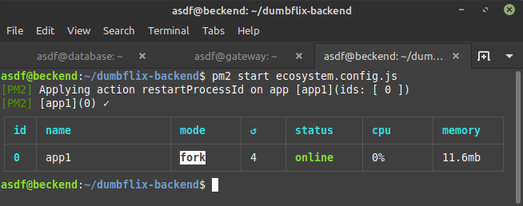

# DEPLOYMENT BACKEND

## Clone Repository

-   Login ke server backend

-   Clone aplikasi backend

    >git clone git@github.com:asdfroot/dumbflix-backend.git

    

-   Instal node.js 14.x

    >curl -o- https://raw.githubusercontent.com/nvm-sh/nvm/v0.39.0/install.sh | bash

    >nvm install 14

    >nvm use 14

    

    

-   Copy file .env

    >cp .env.example .env

    

-   Sesuaikan **deployment** dengan server database seperti **username**, **password**, **database** dan **host**

    >sudo nano dumbflix-backend/config/config.json

    

## Import database with sequelize

-   Instal sequelize

    >npm install --save-dev -g sequelize-cli

    

-   Instal modules dan package yang dibutuhkan

    >npm install

    

-   Selanjutnya lakukan migrate database

    >sequelize db:migrate

    

## Change directory to **backend** and deploy the application

-   Jalankan aplikasi

    >pm2 start ecosystem.config.js

    
