# INSTALL GIT AND SSH KEY

## Repository Fork

-   Login akun Github

-   **Cari** Repository dari link tersebut

  >https://github.com/sgnd/dumbflix-backend

  lalu klik `Fork`

    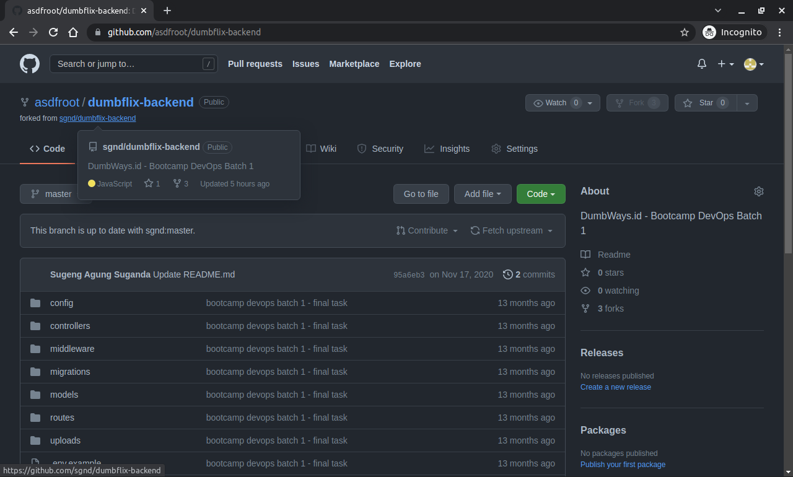

## Create SSH Key for the Git

-   Masuk pada server yang telah dibuat, lalu lakukan update dan upgrade

    >sudo apt update && sudo apt upgrade -y

    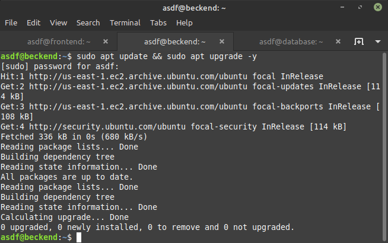

-   Cek Git dan ssh apakah sudah terinstal

    >git --version

    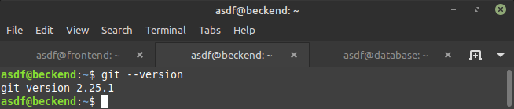

-   Jika sudah terinstal lakukan Git config

    >git config --global user.name "username"

    >git config --global user.email "your-email"

    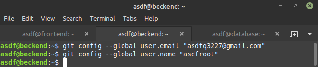

-   Lakukan generate ssh-KEY

    >ssh-keygen -t rsa -b 4096

    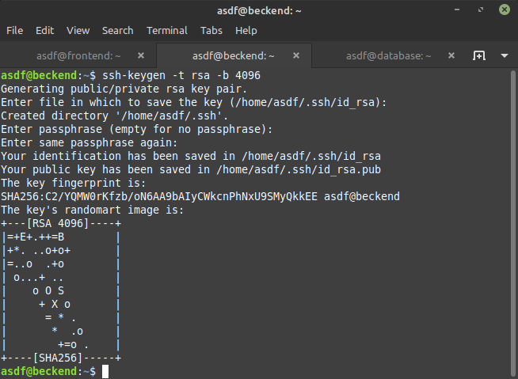

-   Buka **id_rsa.pub** lalu copy

    >cat .ssh/id_rsa.pub

    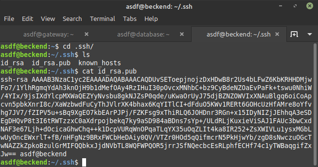

-   Buka akun github dan pastekan **id_rsa.pub** yang sudah di copy

    >https://github.com/settings/ssh/new

    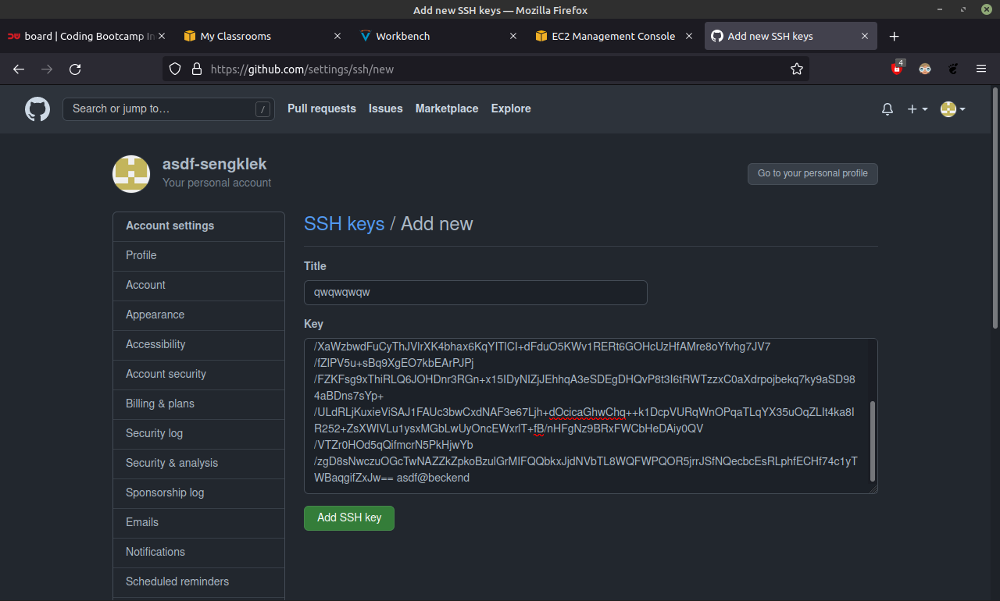

-   Selanjutnya autentikasi SSH ke github

    >ssh -T git@github.com

    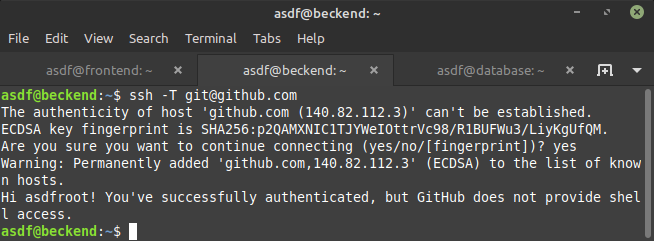

## Git on the server can git pull, git commit, git push without username & password

-   Clone Repository

    >git clone git@github.com:asdfroot/dumbflix-backend.git

    

-   Coba Membuat file baru pada directory github hasil clone

    >cat > init.txt

    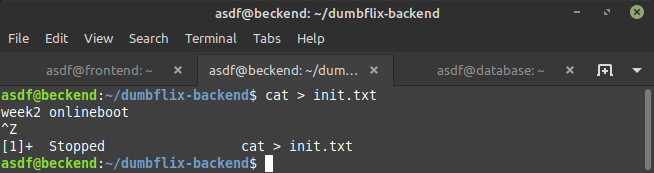

-   Coba melakukan commit

    >git add .

    >git commit -m "pesan"

    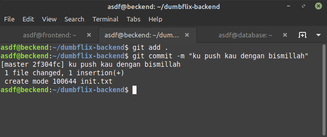

-   Coba melalukan push

    >git push git@github.com:asdfroot/dumbflix-backend.git

    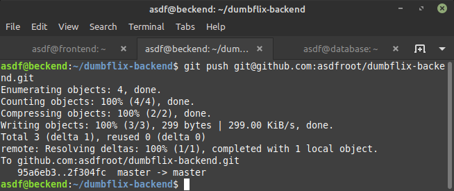

-   Coba melalukan push

    >git pull git@github.com:asdfroot/dumbflix-backend.git

    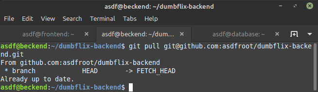

-   Cek perubahan pada Repository

    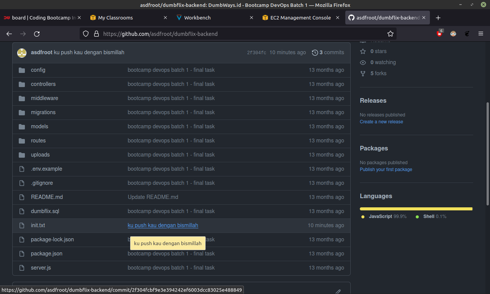
