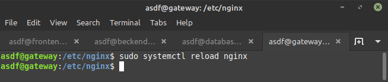

# REVERSE PROXY

## Update and upgrade the operating system

-   Login ke server gateway

-   Lakukan Update and upgrade system

    >sudo apt update && sudo apt upgrade -y

    

## Install web server for reverse proxy

-   Instal web server

    >sudo apt install nginx

    

## Create reverse proxy from application with port 5000 to port 80

-   Setelah login lakukan update dan upgrade

    >cd /etc/nginx/

    >sudo mkdir dumbflix-backend

    

-   Lalu buat file config buat backend

    >sudo nano api.syarif.onlinecamp.id

    

    )

-   sudo nano /etc/nginx/nginx.conf

    >sudo nano /etc/nginx/nginx.conf

    kemudian tambahkan

    >Include /etc/nginx/dumbflik-backend/*;

    

-   Jika sudah,lakukan restart pada nginx

    >sudo systemctl restart nginx

    
