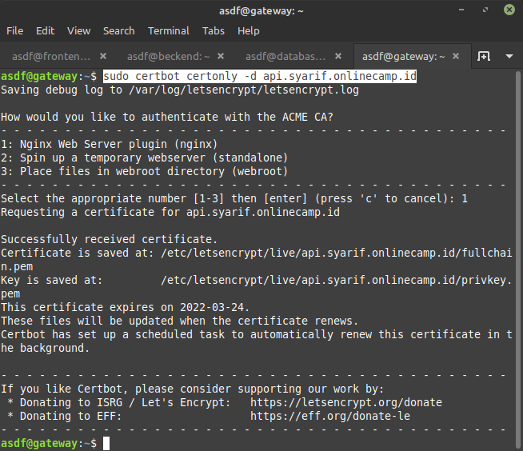
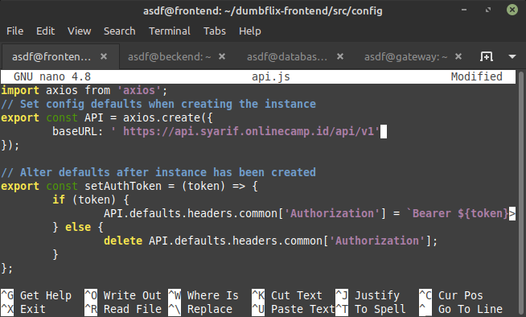
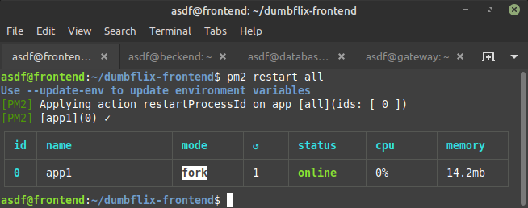
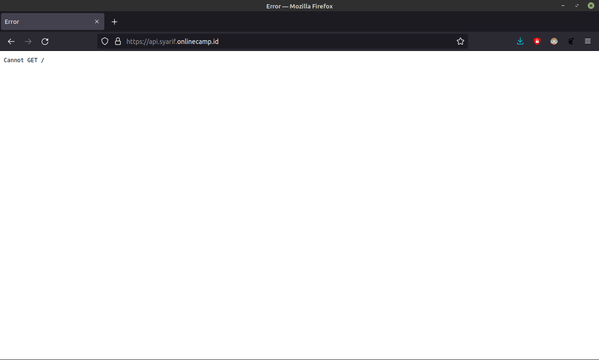
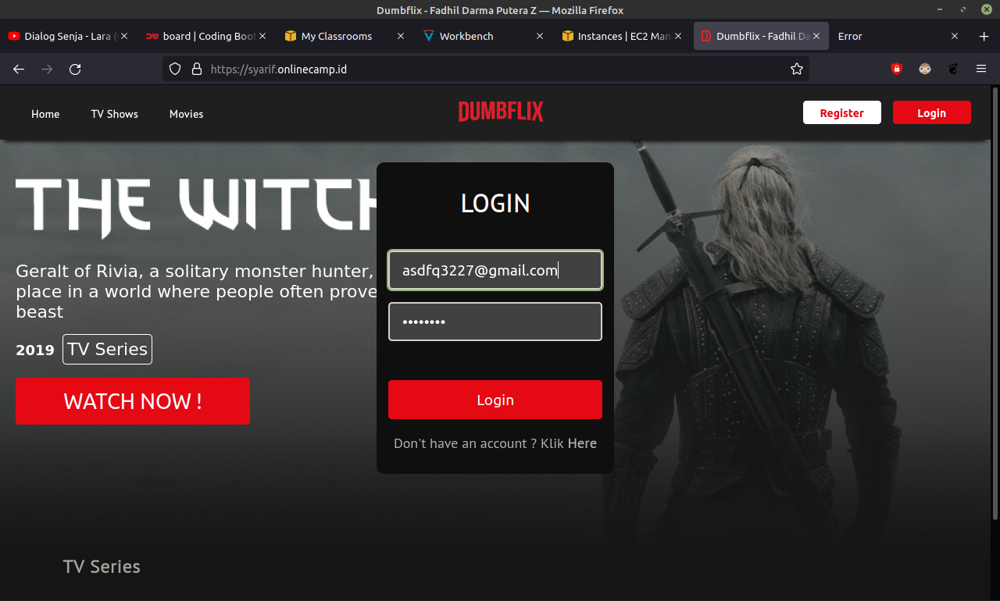
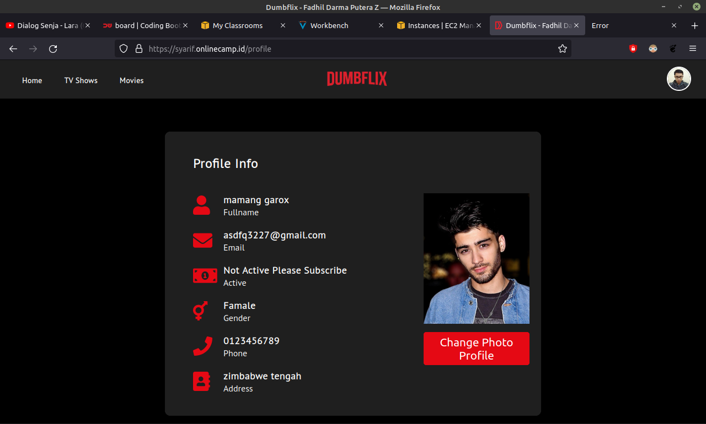

# SSL CONFIGURATION

## applications can access from **https:**

-   Login ke server gateway

-   Lakukan konfigurasi SSL untuk subdomain `api.syarif.onlinecamp.id` menggunakan certbot

    >sudo certbot certonly -d api.syarif.onlinecamp.id

    

-   Login ke server frontend

-   Lalu edit baris baseURL pada api.js diaplikasi frontend

    >sudo nano dumbflix-frontend/src/config/api.js

    

-   Kemudian mulai ulang aplikasi

    >pm2 restart all

    

-   Buka browser dan masukan URL backend apakah konfigurasi SSL berhasil

    >api.syarif.onlinecamp.id

    

-   Coba Login pada aplikasi

       

    
