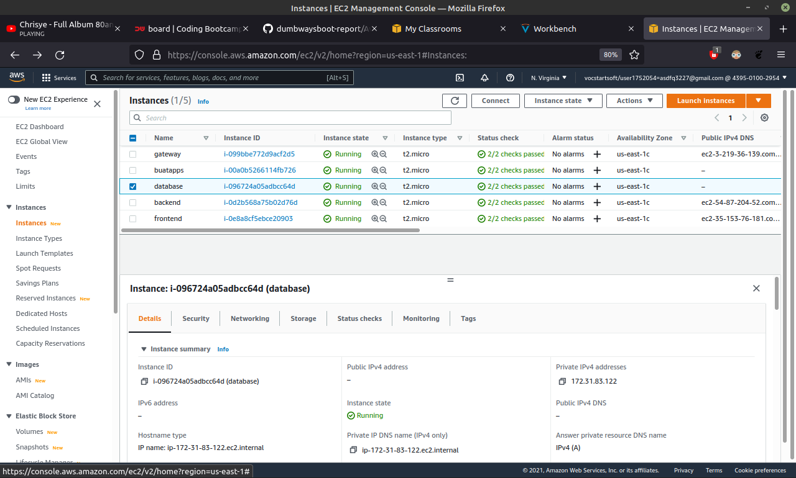
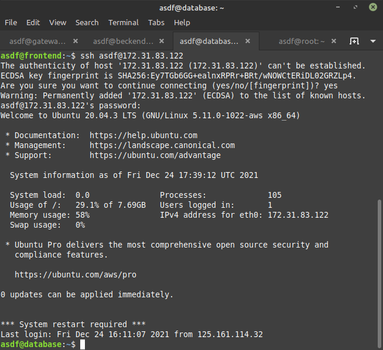
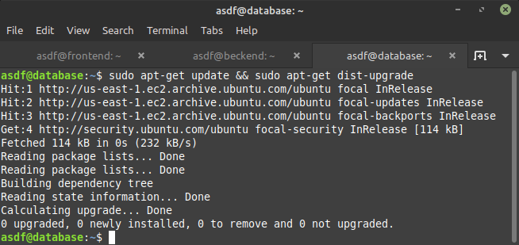
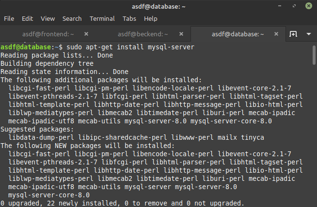
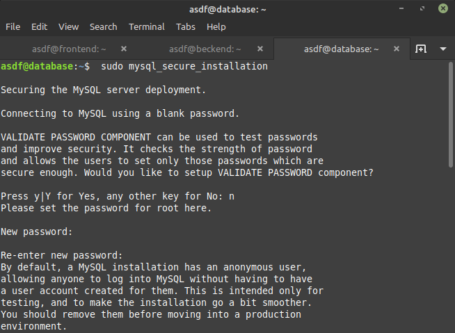
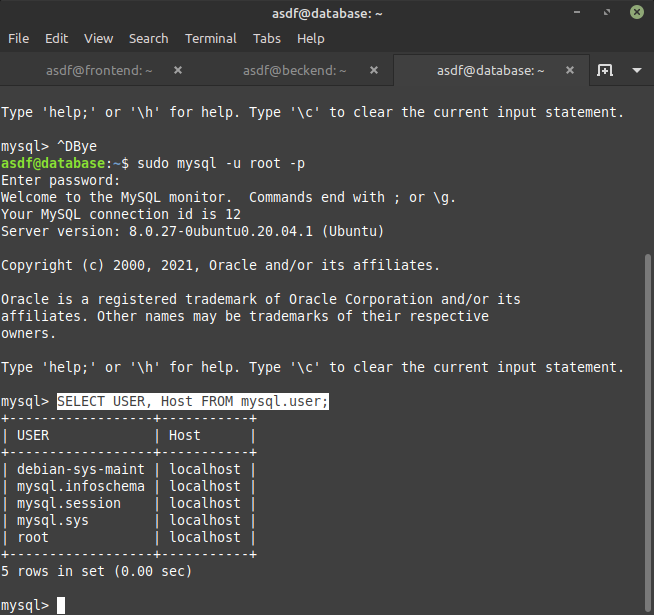
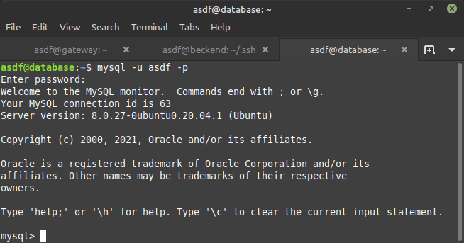
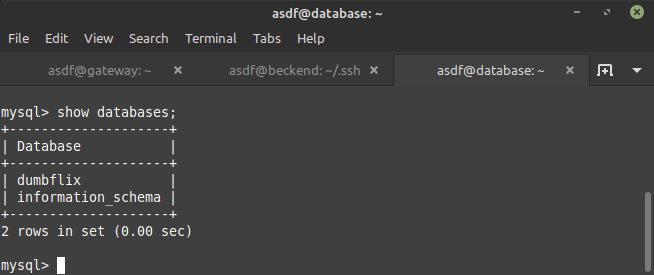
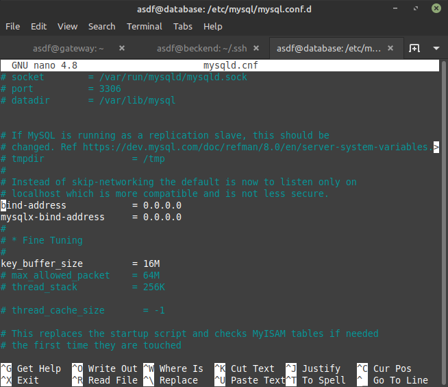
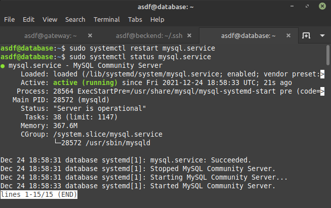

# SETUP DATABASE

## Create new instance for Backend

-   Buat private instance database

    

## Install database on the server

-   Login ke instance database

    

-   Setelah login lakukan update dan upgrade

    >sudo apt-get update && sudo apt-get disk-upgrade

    

-   Lalu instal mysql

    >sudo apt install mysql-server

    

-   Cek mysql

    >sudo systemctl status mysql

    

-   Setup keamanan mysql

    >sudo mysql_secure_installation

    

-   Jika sudah, masuk ke mysql dengan user root

    >sudo mysql -u root -p

    

-   Pada mysql bisa melakukan login tanpa sudo dan membuat user baru

    Login without sudo
    ```
    sudo mysql -uroot
    mysql > SELECT User, Host FROM mysql.user;
    mysql > DROP USER 'root'@'localhost';
    mysql > CREATE USER 'root'@'localhost' IDENTIFIED BY 'STRING-PASSWORD-NYA';
    mysql > GRANT ALL PRIVILEGES ON *.* TO 'root'@'localhost' WITH GRANT OPTION;
    mysql > FLUSH PRIVILEGES;
    mysql > exit
    mysql -uroot
    ```
    Create new user
    ```
    CREATE USER 'newuser'@'%' IDENTIFIED BY 'password';
    GRANT ALL PRIVILEGES ON *.* TO 'newuser'@'%';
    FLUSH PRIVILEGES;
    ```

    

-   Melihat database

    >show databases;

    

## Can remote on the database from the client

-   Buka directory dan edit pada **blind-address** dan **mysql-blind-address**

    >sudo nano /etc/mysql/mysql.conf.d/mysqld.cnf

    

-   Jika sudah lakukan restart pada mysql

    >sudo systemctl restart mysql-service

    
